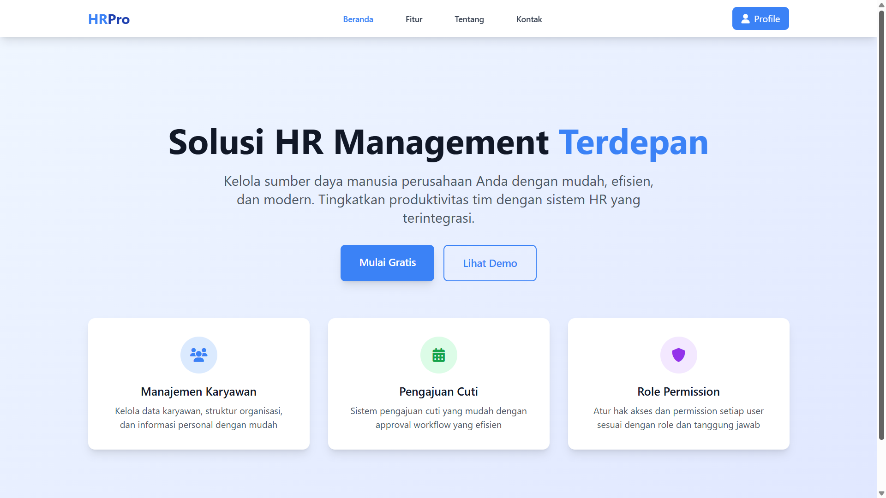

# 🧑‍💼 HR Management System – Laravel + Filament

Proyek ini adalah Sistem Manajemen Sumber Daya Manusia (SDM) berbasis web yang dibangun dengan Laravel dan Filament Admin. Sistem ini dirancang untuk membantu organisasi mengelola data karyawan dan proses terkait SDM secara efisien dalam dasbor terpusat. Sistem ini terhubung ke basis data MySQL untuk menyimpan dan mengelola semua data dengan aman.

## Features
- 🧑‍💻 Manajemen Karyawan (Tambah, Edit, Hapus, Lihat)

- 📅 Kelola Tanggal Mulai Kerja

- 🔍 Cari & Filter Data Karyawan

- 📊 Dasbor yang bersih dan modern dengan UI Filament

- 🔐 Autentikasi dan otorisasi dengan shield untuk akses aman

- 📈 Keluar dari manajemen karyawan

## 🛠 Tech
- Laravel 12 – Kerangka kerja PHP untuk pengembangan aplikasi web

- Filament – ​​Pembuat panel admin yang elegan untuk Laravel

- Tailwind CSS - Sebagai UI Frontend

- MySQL – Basis data relasional untuk menyimpan data aplikasi

- PHP 8.3 – Bahasa pemrograman backend


## ♻️Installation
```bash
  git clone https://github.com/4lifbima/web_pegawai.git
```
```bash
  cd web_pegawai
  composer install
```
```bash
  copy .env.example to .env and configurate with your database 
```
```bash
  php artisan migrate --seed
```
```bash
  php artisan serve
```

## 👥 Contributor
 
 

<hr>
Participating developers

## 📜 License

Permission is hereby granted, free of charge, to any person obtaining a copy
of this software and associated documentation files (the "Software"), to deal
in the Software without restriction, including without limitation the rights
to use, copy, modify, merge, publish, distribute, sublicense, and/or sell
copies of the Software, and to permit persons to whom the Software is
furnished to do so, subject to the following conditions:

MIT License

Copyright (c) 2025 Alifbima

    
